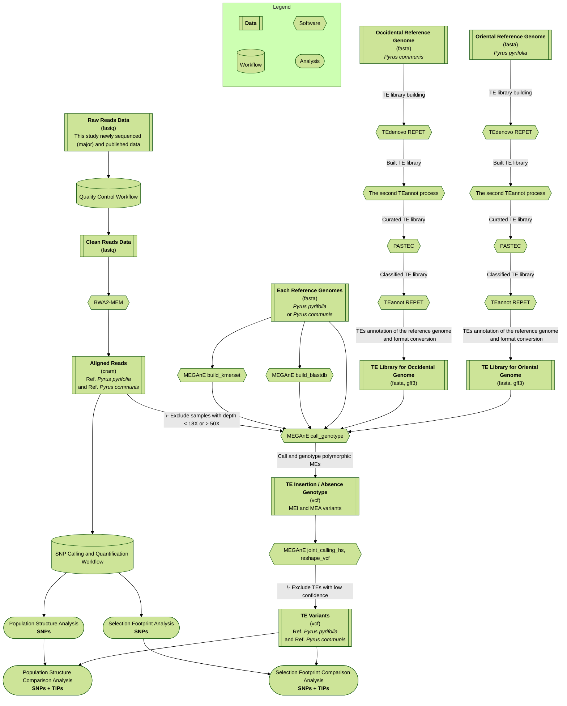

# Contrasting genomic routes to domestication in Occidental and Oriental pears
[](https://doi.org/10.1101/2025.11.17.687327)    [](https://doi.org/10.5281/zenodo.17673915)    [](https://www.ebi.ac.uk/ena/browser/view/PRJEB104237)    [](https://urgi.versailles.inrae.fr/repetdb)

## Associated Publication

This repository contains the full analytical pipeline and custom scripts for the following study. The manuscript is currently under peer review.

> Yuqi Nie, Xilong Chen, Somia Saidi, et al. (2025). Contrasting genomic routes to domestication in Occidental and Oriental pears. bioRxiv 2025.11.17.687327; doi: https://doi.org/10.1101/2025.11.17.687327

**Citation**: Please cite the bioRxiv version if you use any part of this code or the associated methodology.

**Correspondence**: Dr. Xilong Chen, Prof. Karine Alix, Prof. Yuanwen Teng, and Dr. Amandine Cornille.

**Data availability**:
The SNP datasets generated in this study have been deposited in the Zenodo database under accession code zenodo.17673915. And raw sequencing data have been deposited in the European Nucleotide Archive (ENA) under accession code PRJEB104237, which are available but currently restricted and will be released upon publication. TE consensus sequences are available in the RepetDB database (https://urgi.versailles.inrae.fr/repetdb)."


## The workflow for bioinformatic analysis used in this study (SNPs part)

Fig S1 The workflow of the study

```mermaid
%%{init: {'theme':'forest',
  "themeVariables": {
    "fontSize": "14px",
     "fontFamily": "Arial"
    }
}}%%

flowchart TD

ROW_DATA[["`**Raw Reads Data**
    (fastq)
    Published data from previous studies and newly generated data from this study`"]]

    --> QUALITY_CONTROL{{fastp, fastQC, MultiQC}}
    --  Remove redundant samples
        Remove low quality samples
        Remove&nbsp;samples&nbsp;with&nbsp;sequencing&nbsp;depth&nbsp;below&nbsp;9X
    
    --> CLEAN_DATA[["`**Clean Reads Data**
            (fastq)
            *N* = 674`"]]
    QUALITY_CONTROL
      ~~~
    gatk

    CLEAN_DATA
    --> gatk{{BWA2, Picard, GATK4, bcftools, Plink2 kinship}}

    --- L1[\Level 1 and 2 Filters/]

    --  Remove low quality sites
        Remove&nbsp;high&nbsp;SNP&nbsp;missing&nbsp;rate&nbsp;(>40%)&nbsp;samples
        Remove&nbsp;genetically&nbsp;closely&nbsp;related&nbsp;samples&nbsp;(KING&nbsp;kinship&nbsp;>&nbsp;0.354)
        Remove&nbsp;samples&nbsp;with&nbsp;unclear&nbsp;passport&nbsp;information
    
    --> FILTERED_GENOTYPE[["`**Filtered Genotype Data**
            (vcf)
            *N* = 396
            Ref. *Pyrus pyrifolia*
            and Ref. *Pyrus communis*`"]]
    
    -- -Only Invariant sites
    --> FILTERED_INVARIANT[["`**Filtered Invariants**
            *N* = 229`"]]

REF_GENOME_W[["`**Reference Occidental Pear Genome**
            (fasta)
            *Pyrus communis*`"]]
    --> gatk

REF_GENOME_E[["`**Reference Oriental Pear Genome**
            (fasta)
            *Pyrus pyrifolia*`"]]
    --> gatk

    
FILTERED_GENOTYPE
    --  -Only biallelic SNPs
    
    --> FILTERED_VARIANT[["`**Filtered Variants**
            *N* = 396`"]]

    --- L3[\Level 3 Filters/]
    -- Remove&nbsp;nonsynonymous&nbsp;substitution&nbsp;sites
       MAF&nbsp;<=&nbsp;0.05
       LD thinning

    --> UNLINKED_VARIANT[["`**Unlinked Variants**
            *N* = 396`"]]



UNLINKED_VARIANT
    --> splittree{{Splitstree}}
    --> tree([Neighbor-net tree])


UNLINKED_VARIANT
    --> plinkpca{{Plink PCA}}
    --> pca([PCA])


UNLINKED_VARIANT
    --> faststrcuture{{fastStructure}}
    --> structure([Population Structure])


REF_GENOME_BOTH[["`**Both Reference Genomes**
            (fasta)
            *Pyrus pyrifolia*
            and *Pyrus communis*`"]]
    --> genemap{{genemap, CentIER}}
    -.  Mask low mappability and centromeric regions
    .-> FINAL_VARIANT

REF_GENOME_BOTH
    --> sift_anno{{SIFT4G annotator}}
    -.-> FINAL_VARIANT

FILTERED_GENOTYPE
    --> FINAL_VARIANT
structure
    -.  Remove&nbsp;admixed&nbsp;samples&nbsp;and&nbsp;keep&nbsp;229&nbsp;pure&nbsp;samples&nbsp;belonging&nbsp;to&nbsp;12&nbsp;populations
        Identification&nbsp;of&nbsp;cultivated&nbsp;and&nbsp;wild&nbsp;populations
    .-> FINAL_UNLINKED_VARIANT[["`**Final Unlinked Variants**
            *N* = 229`"]]



structure
    -.  Remove&nbsp;admixed&nbsp;samples&nbsp;and&nbsp;keep&nbsp;229&nbsp;pure&nbsp;samples&nbsp;belonging&nbsp;to&nbsp;12&nbsp;populations
        Identification&nbsp;of&nbsp;cultivated&nbsp;and&nbsp;wild&nbsp;populations
    .-> FINAL_VARIANT[["`**Final Filtered Variants**
            *N* = 229
            Ref. *Pyrus pyrifolia*
            and Ref. *Pyrus communis*`"]]


REF_GENOME_BOTH
    --> eggNOG{{eggNOG-mapper, PlantTFDB, NLGenomeSweeper, TAIR, UniPort, FLOR-ID, GO, KEGG}}
    --> anno(["`**Genes Functional Annotation**`"])


FINAL_VARIANT
    -- Wild and cultivated populations
    --> sift4g{{SIFT4G}}
    --> sift(["`**Deleterious Variants Prediction**`"])


FINAL_VARIANT
    --> smc{{SMC++}}
    --> history(["` **Historical _Ne_** `"])


FINAL_VARIANT
    -- Cultivated and wild populations
       (focus on cultivars)
    --> omegaplus{{OmegaPlus}}
    --> omega(["`**_ω_**`"])

regionR{{regionR}}
    -. Permutation Test for Selection Regions
    .-> omega


regionR
    -. Permutation Test for Selection Regions
    .-> tajima

pixy2{{Pixy}} 
    -->tajima(["`**Tajima's *D***`"])

FINAL_VARIANT
    --> Dsutie{{Dsuite}}
    --> abba_baba(["`**D and f4-ratio statistic**`"])

FINAL_VARIANT
    --> FINAL_ALL_SITES[["`**Final All Sites**
            *N* = 229
            both invariant and variant sites`"]]


FILTERED_INVARIANT
    --> FINAL_ALL_SITES


FINAL_ALL_SITES
    --> pixy{{Pixy}}
    --> Pi(["`**_π_, _F_<sub>ST</sub>, _d<sub>XY</sub>_**`"])


UNLINKED_VARIANT
    --> FINAL_UNLINKED_VARIANT

FINAL_UNLINKED_VARIANT
    --> stacks{{Stacks Population}}
    --> statistics(["`**Population Genetics Statistics**`"])


FINAL_UNLINKED_VARIANT
    --  Merge&nbsp;18&nbsp;loquat&nbsp;samples&nbsp;as&nbsp;the&nbsp;outgroup
    --> svd{{SVDQuartets}}
    --> sptree(["`**Species Tree**`"])


svd
    -.-> modeling


FINAL_UNLINKED_VARIANT
    --> fastsimcoal{{fastsimcoal}}
    --> modeling(["` **Demographic Modeling** `"])


ABBA{{Dsuite}}
    -.-> modeling


FILTERED_VARIANT
    --> ld{{PopLDdecay}}
    --> LD(["`**LD decay**`"])


%% Subgraph section --------------------------------
subgraph Fig.1 Population Structure
    pca
    tree
    structure
end

subgraph Fig.2 Demographic History
    history
    Pi
    abba_baba
    sptree
    modeling
    statistics
end


subgraph Fig.4 Genetic Burden
    sift
end


subgraph "Fig.3&nbsp;Selection&nbsp;Footprint&nbsp;in&nbsp;Domestication"
    omega
    tajima
    anno
end



%% Legend section ------------------------------------

DATA[["`**Data**`"]]
    ~~~
software{{Software}}

filter[\Filters/]
    ~~~
analysis([Analysis])


subgraph Legend
    DATA
    software
    filter
    analysis
end


%% Configurations -----------------------------------
classDef empty fill:transparent,width:-1px,height:-1px,stroke:transparent;
classDef data fill:transparent,width:-1px,height:-1px,stroke:transparent;
classDef software fill:transparent,width:-1px,height:-1px,stroke:transparent;
classDef filter fill:transparent,width:-1px,height:-1px,stroke:transparent;
```




## The workflow for bioinformatic analysis used in this study (part integrating SNPs and TIPs)



## Repository Overview & Setup
This repository provides analysis scripts organized by topic (e.g., QC, variant calling, population structure, and OmegaPlus). Workflows are implemented as standalone scripts in module-specific directories.

Typical structure:
- `run_<analysis_module_name>/bin/`: Executable scripts (.sh, .py, .R, .pl, etc.)
- `run_<analysis_module_name>/Readme.md`: Module-specific documentation
- `run_<analysis_module_name>/bin/*_config.py` / `*.config.sh`: Local paths and parameters
- `run_<analysis_module_name>/input/`: folder for VCF/FASTA/GFF/sample metadata files (not included in the repo; see data availability section)
- `run_<analysis_module_name>/output/`: folder results generated by the scripts (not included in the repo)

### Prerequisites
- Linux (HPC/cluster environment recommended)
- Bash, Python 3, Perl, R
- Core bioinformatics tools: bcftools, samtools, bedtools, plink2, gatk, bwa-mem2, etc.

Clone the repository and set up a base environment:
```Bash
git clone git@github.com:CornilleEclecticLab/pear-SNP.git
cd pear-SNP
```

### Example base conda/mamba environment
```bash
mamba create -n pear-snp python=3.11 r-base=4.3 bcftools samtools bedtools plink -y
mamba activate pear-snp
```
Tip: Check `bin/s00*.sh`, `bin/s00*.py`, or the module's `Readme.md` for analysis-module-specific dependencies (e.g., Ruby, Java, fastsimcoal2).

### Executing Analyses
Modules are independent. Always run scripts from inside the module's `bin/` directory in numerical order (e.g., s00 → s01 → s02). The s00 scripts typically handle dependency loading, database downloads, and configuration.

Crucial Steps Before Running:
Configuration: You must edit `s00.config.sh` or `s00_config.py` to match your local paths (VCF/FASTA/GFF) and cluster environment. 

Input data requirements:
At minimum, most workflows require some combination of:
- **Filtered VCF files**. Variant-only or variant+invariant, and variant can be LD purned+synonimous or not, depending on analysis.
- **Reference genome FASTA**. In our case, we have used two reference genomes: "*Pyrus pyrifolia* Cuiguan" (https://doi.org/10.1038/s41438-021-00632-w) and "*Pyrus communis* Bartlett" (https://doi.org/10.1093/gigascience/giz138) for Oriental and Occidental pears, respectively, to reduce reference bias in population genetic analyses.
- **Genome annotation GFF/GTF**.
- **Sample metadata/population assignment files**. The results should be from fastStructure, neighbor-net tree and PCA analyses, rather than the previous passport information.
- **Optional masks/bed regions** Many modules require a `BED` mask to filter out low-mappability and centromeric regions. We provide a ready-to-use bed file for the passed` via Zenodo: file named "`GWHBAOS00000000.chr_list.fasta_centromere_range.txt.genmap_pass_subtract_centier.bed`" for *Pyrus pyrifolia* Cuiguan reference.

Different modules are tailored to either:
- **SNP-only analyses**, or
- **SNP + TIP (transposable insertion polymorphism) integration**.


## Example Workflow: SIFT4G Annotation & Mutation Burden
This example demonstrates running the deleterious-variant workflow on an HPC cluster using Slurm. The input is a full SNP dataset (SIFT4G will specifically evaluate CDS regions).

```bash
# 1. Launch interactive session using Slurm srun
srun --pty -c 4 --mem=16G --time=04:00:00 bash

# 2. Enter module bin directory
cd run_SIFT4G/bin

# 3. Download databases & load dependencies

## This following script downloads `SIFT4G_Annotator.jar` and built SIFT4G within an apptainer image within the new created folder named `SIFT4G_Create_Genomic_DB.NOGIT`.
bash s00.download_sift4g.sh 
bash s00.download_UniRef.sh
## Load dependencies. Plese adjust according to your environment.
source s00.load_bcftools.sh
source s00.load_bedtools.sh
# or if you have them in your conda environment, just activate it:
# mamba activate pear-snp

# 4. Configure parameters
# Choose a reference (e.g., Oriental pear PPY or Occidental pear PCOM).
# Please edit s00.config_PPY.sh to update your local paths before proceeding!

# 5. Run sequential preparation scripts (example using PPY)
bash s01.a1.prepare_fasta_gtf_PPY.sh
bash s01.build_sift4g_db_PPY.sh
bash s02.annotate_vcf_against_sift4g_db_PPY.sh

# 6. Generate and submit parallel jobs to split VCF by population
python s03.get_vcf_by_pop_from_variant.py
cd s03.get_vcf_by_pop_from_variant
for job in *.sh; do sbatch "$job"; done
cd ..

# 7. Analyze and plot (execute after Slurm jobs finish)
## s04: Outputs the population baseline genetic load at the whole-genome level.
## Please edit s04_config.py to update your local paths and cluster environment before running.
python s04.analysis_mutation_burden.py
Rscript s05.plot.R

# 8. Run deleterious mutation sweep analysis
## s06: Implements a highly flexible genetic load normalization strategy. 
## Computes relative load (de_per_denominator) normalized by effective physical length (CDS), total variant count (SNP), or neutral mutation baseline (synonymous).
## Please edit s06_config.py to update your local paths and cluster environment before running.

## Preparation
python s06.a1.merge_sweep_bed.py
python s06.a2.mask_cds.py

## Analysis
bash s06.deleterious_mutation_sweep.01_pre.sh

## Plotting
Rscript s07.dm_sweep.03_plot.R

#### END 🍐Bravo🥳
```

## Test dataset and performance evaluation status
To keep the Git repository size manageable, this repository does not include the full public test dataset. Instead, we provide the SNP datasets and a sample subset for testing on Zenodo (https://doi.org/10.5281/zenodo.17673915). Additionally, the TE consensus sequences are available via RepetDB (https://urgi.versailles.inrae.fr/repetdb).

### Current limitation
We cannot provide standardized performance metrics (runtime/memory/accuracy) across all workflows for other public dataset. And it is difficult to provide a single test dataset that can be used for all modules, given the diversity of analyses.

### What users can do now
- Validate each module locally using a small subset of your own data.
- Confirm script correctness by checking expected intermediate files per step.
- Record environment details (tool versions, CPU/RAM, OS) when comparing performance.

## Reproducibility notes
To improve reproducibility in your own runs, those information can be useful if you wish archive:
- Exact commit hash of this repository
- Full command history for each module
- Software versions
- Config files used (`s00.config.sh`, `s00_config.py`, etc.)
- Cluster execution context
