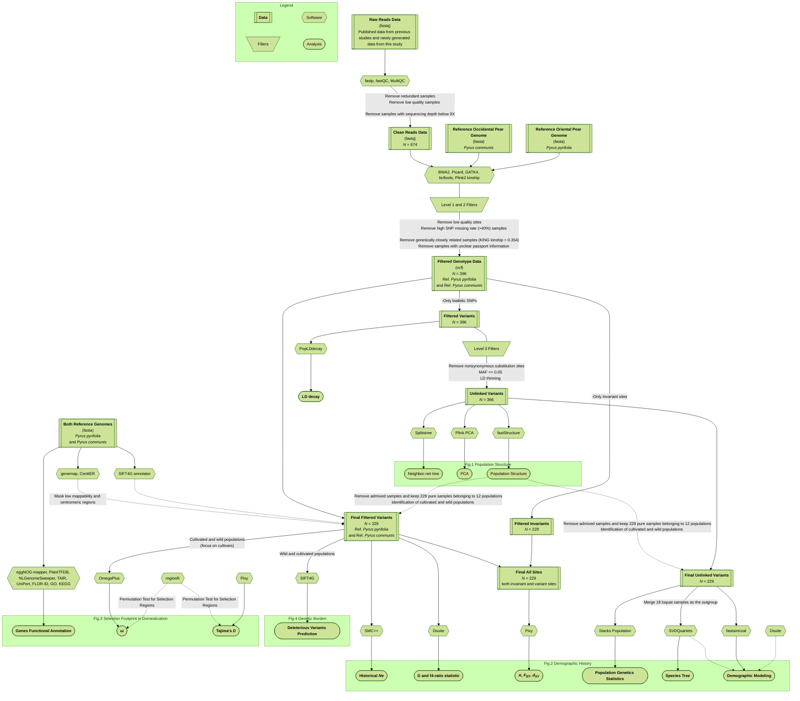

# Contrasting genomic routes to domestication in Occidental and Oriental pears

## The workflow for bioinformatic analysis used in this study (SNPs part)

Fig S1 The workflow of the study

## The workflow for bioinformatic analysis used in this study (part integrating SNPs and TIPs)

